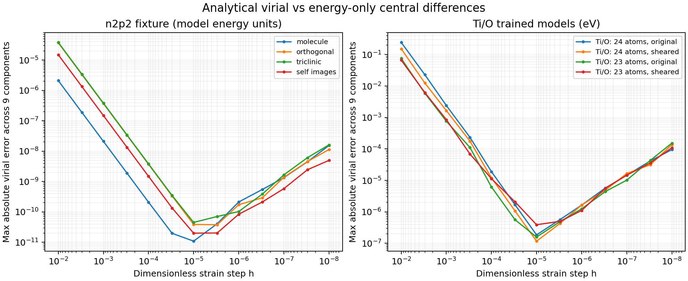

# Virial finite-difference validation — 2026-09-25

The analytical virial agrees with energy-only central differences in every
tested component. On the two Ti/O structures and their sheared versions,
the smallest maximum errors are **1.17e-7 to 3.90e-7 eV**, at **h = 1e-5**.
AUTO, DIRECT, and MOMENT evaluation modes all pass. The atomic and structure
APIs agree to the reported precision in these runs.



## Method and acceptance

For every component, deform both positions and lattice vectors with
`A = I +/- h*e_ba`, keeping fractional coordinates fixed. Compare the
analytical `W(a,b)` to `-[E(A_plus)-E(A_minus)]/(2*h)`; neither forces nor
analytical virials are used to compute the numerical reference.

Use 13 strain steps: `1e-2, 3e-3, 1e-3, 3e-4, 1e-4, 3e-5, 1e-5, 3e-6,
1e-6, 3e-7, 1e-7, 3e-8, 1e-8`. Both APIs return energy-unit virials, without
volume division or kinetic terms. There is no factor of one half.

At least two adjacent steps must simultaneously pass all nine components:
`abs(error_ab) <= 2e-6 + 2e-7*abs(W_ab)`, in model energy units.
This per-component tolerance does not depend on total reference energies.
When the coarsest error exceeds ten times the maximum tolerance, the
convergence driver also requires a decrease by at least a factor of 100.
The errors decrease approximately quadratically over the coarse-step range,
then rise as energy subtraction amplifies roundoff. In particular, `h=1e-8`
is less accurate than `h=1e-5` for the Ti/O models; making h arbitrarily small
is not a valid acceptance criterion.

## Results

The table shows AUTO mode; all three Ti/O modes have the same rounded results.
Errors are maxima across the nine components. n2p2 values are in model
energy units; the Ti/O values are in eV.

| Model / geometry | Best h | Error at best h | Error at h=1e-2 | Error at h=1e-8 |
|---|---:|---:|---:|---:|
| Bundled n2p2 model: molecule | 1e-05 | 1.089e-11 | 2.108e-06 | 1.535e-08 |
| Bundled n2p2 model: orthogonal | 3e-06 | 3.785e-11 | 3.713e-05 | 1.129e-08 |
| Bundled n2p2 model: triclinic | 1e-05 | 4.512e-11 | 3.822e-05 | 1.611e-08 |
| Bundled n2p2 model: self_images | 1e-05 | 1.996e-11 | 1.493e-05 | 4.969e-09 |
| Ti/O: 24 atoms: original | 1e-05 | 1.853e-07 | 2.452e-01 | 9.528e-05 |
| Ti/O: 24 atoms: sheared | 1e-05 | 1.170e-07 | 1.533e-01 | 1.381e-04 |
| Ti/O: 23 atoms: original | 1e-05 | 1.579e-07 | 7.556e-02 | 1.534e-04 |
| Ti/O: 23 atoms: sheared | 1e-05 | 3.901e-07 | 6.673e-02 | 1.097e-04 |

The n2p2 cases include a molecule, an orthogonal periodic cell, a triclinic
cell, and a single atom whose periodic images give nonzero virial despite
zero net force. The Ti/O original cells contain 24 and 23 atoms. Their
additional shears use `A(1,2)=0.07`, `A(2,3)=-0.04`, and unit diagonal.
The separate synthetic suite covers Chebyshev AUTO/DIRECT/MOMENT and the
LJ full-Jacobian path, empty neighborhoods, translation invariance, additive
atomic outputs, and file/in-memory interfaces. Its 25 cases also pass the
13-step sweep.

Raw data:

- [n2p2: each component at every step](virial-convergence-n2p2.csv)
- [Ti/O 24 atoms: each component at every step and mode](virial-convergence-structure0001.csv)
- [Ti/O 23 atoms: each component at every step and mode](virial-convergence-structure2935.csv)
- [Synthetic suite: maximum errors per step](virial-convergence-synthetic.csv)

## Reproduction

From the repository root, configure with an external Ti/O reference corpus:

```sh
cmake -S . -B build -DCMAKE_BUILD_TYPE=Release \
  -DACCELNET_PREDICTOR_GOLDEN_DIR=/path/to/fortran_predict
cmake --build build --target test_virial test_virial_c test_virial_convergence --parallel 2
ctest --test-dir build -R virial --output-on-failure
```

Without that corpus, the synthetic and bundled n2p2 tests still run. The
external Ti/O model files are not copied into the repository. Their hashes:

| File | SHA-256 |
|---|---|
| `Ti.nn.ascii` | `e1c79e4ab02d713a267cd4f3bfaeb0e6d35513d36b9e58e51cd2d541d6c9f123` |
| `O.nn.ascii` | `022cc2f3f86a29873ea5350fb485d8ace172b442d67f84fce1594ae5081c59c0` |
| `structure0001.xsf` | `573a08c59e3b5714f621135de3c775e7d7dfa9145371443a9c60a8272c3ddc08` |
| `structure2935.xsf` | `1a446caad0ddeb48fb073fb008022d082e8ed113623eec654ffe87ff3ae38fb7` |

Code base: `88673fa134ed9c0e81af600544db48fb6755e0e3`, with the local `feat/atomic-virial` changes.
Measurements used GNU Fortran 11.4.0 on Linux, Release build.
The initial **30 configured tests** passed with the external corpus. The self-contained
GitHub Actions configure/build/test commands were also reproduced locally:
**17/17** passed for Release/static and **17/17** for Debug/shared with
`-fcheck=all -fbacktrace`, both using GNU 11. CI additionally selects GNU 13
on Ubuntu 24.04; that runner has not been executed locally or on GitHub yet.

These results validate the sampled models and geometries, not arbitrary
models, all compiler platforms, or the still-pending PIMD integration.

Subsequent [additional regression tests](additional-tests.md) increased the
counts to **34** with the external corpus and **21** in each self-contained
CI build. They also exposed and fixed the triclinic unwrapped-coordinate bug.
The table and CSV data above preserve the original measurement; the initial
n2p2 convergence geometry had two atoms. The current driver uses three atoms
to exercise nonperiodic angular contributions as well.
